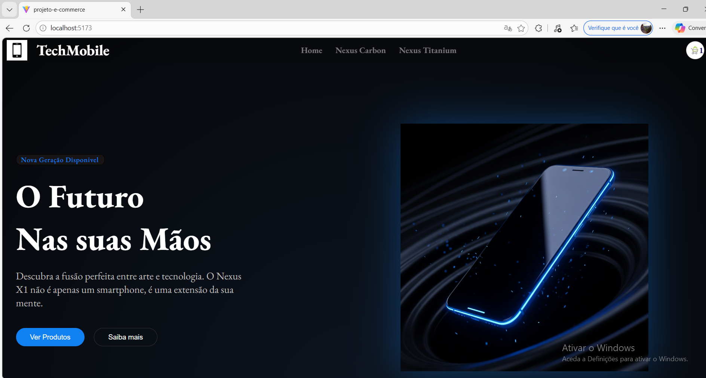

#  E-Commerce React App

Aplicação de e-commerce desenvolvida com React, focada na gestão de estado global, navegação entre páginas e boas práticas de desenvolvimento front-end moderno.

Este projeto simula uma loja online com listagem de produtos,página de detalhes e carrinho de compras dinâmico.

---

##  Preview

<p align="center">
  
</p>

---

##  Funcionalidades
 
-  Página de detalhes do produto  
-  Carrinho de compras funcional  
-  Adicionar e remover produtos do carrinho  
-  Atualização dinâmica de quantidade  
-  Cálculo automático do total  
-  Navegação entre páginas com React Router  
-  Gestão global de estado com Context API  

---

##  Tecnologias Utilizadas

- React  
- React Router DOM  
- Context API  
- JavaScript (ES6+)  
- CSS3  
- React Hooks (useState, useEffect, useContext)  

---

##  Conceitos Aplicados

- Componentização e reutilização de componentes  
- Gestão de estado local e global   
- Manipulação de arrays e objetos  
- Props  e Context 
- Efeitos colaterais com useEffect  
- Boas práticas de organização de pastas  

---

##  Estrutura do Projeto
 
 src/
    components/
    pages/
    context/
    data/
    images/
    App.jsx
    main.jsx


---

## ▶️ Como Executar o Projeto

```bash
npm install
npm run dev